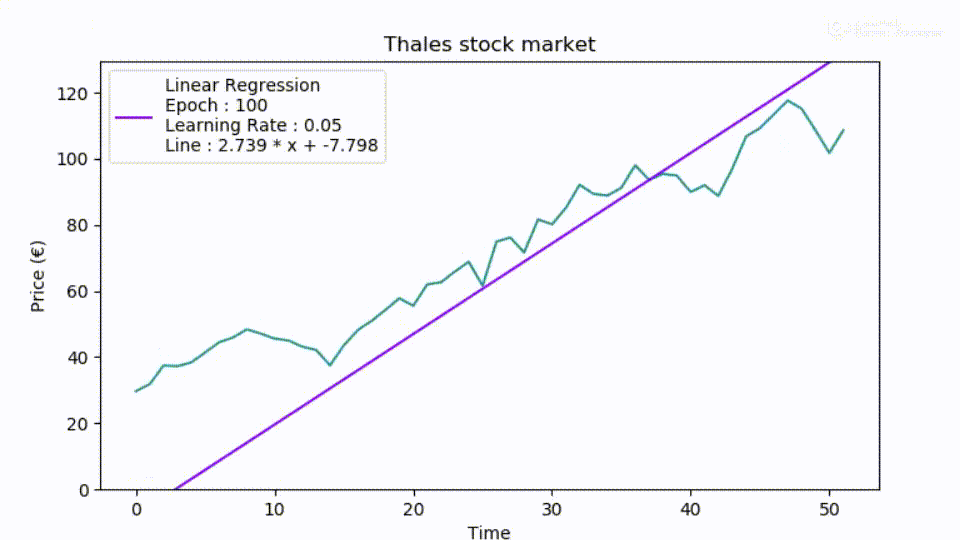
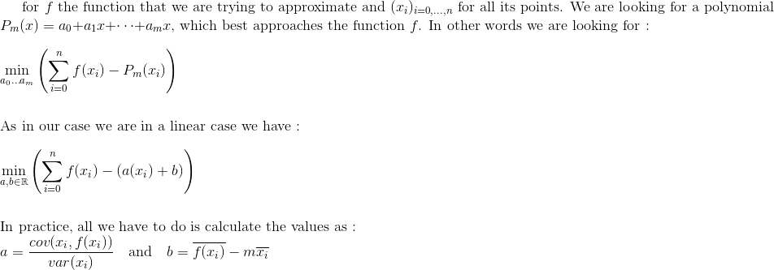
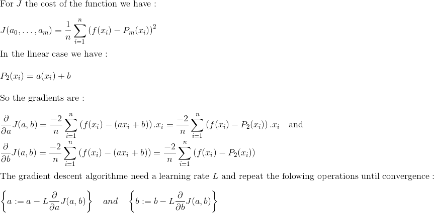

## Linear regression principle

The linear regression is one the basic way to forge a rapport between variables. As its name indicates, the principle is to reduce a function to a linear form. In other words, the linear regression seeks to model associations between variables. Like other regression models, the linear regression model is used both to predict a phenomenon and to explain it.



## Linear regression application

### Least squares method 

The common method of linear regression is the least squares method. It aims to find a polynomial, which best represents the function to interpret. So it tries to find the polynomial, which has the minimum difference with the function.




### Gradient descent method : Introduction to Machine Learning


The gradient descent method for linear regression is not useful. Yet it is the best example to introduce the gradient descent application in machine learning algorithms. In those algorithms, the variables are dynamically changing according to the error they induce. For a better understanding I invite you to alternate between the theory and the practice case as the theory may be a little uncomfortable. 

In the linear regression case we have two dynamic variables : `a` and `b`, which compose the polynomial `P = a * x + b` approaching the function to approximate.

Firstly `a` and `b` have a starting value, random or choosen. According to the error function (which can be the euclidean function), the gradient for each variables are calculate.
Then the algorihtm changes step by step the variable's values according to minimize the error function. So each variables is changing according to its gradient. The changes are made until convergence. Here a mathematical explanation easier to understand :


It is important not to choose a learning rate to high or to low. 




## Thales stock prices case

The linear regression case here will be made through the Thales stock prices case. In this application we can use the linear regression to predict and explain the stock prices evolution. Explain means report the stock prices a posteriori.
You can find the data I use for the case in [this website](https://www.abcbourse.com/download/download.aspx?s=HOp).

## Pseudo Code

### Least squares method

```
```

### Gradient descent method

```
```

## Let's start with python

### Variables 

```python
```

### Load dataset


```python
```

### Least squares method

```python
```


### Gradient descent method

```python
```

```python
```


### Display


```python
```

```python
```
### Run it ! 


```python
```
