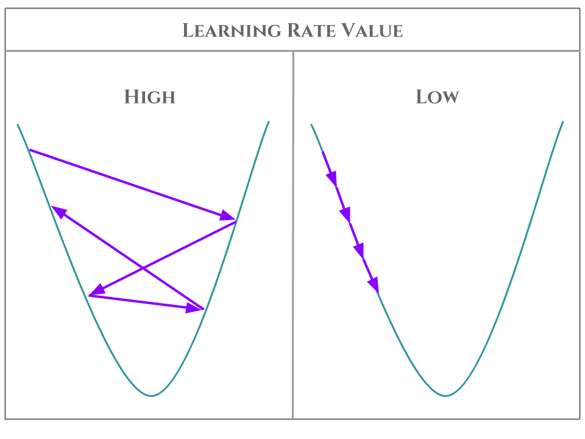

## Linear regression principle

The linear regression is one the basic way to forge a rapport between variables. As its name indicates, the principle is to reduce a function to a linear form. In other words, the linear regression seeks to model associations between variables. Like other regression models, the linear regression model is used both to predict a phenomenon and to explain it.


## Linear regression application

### Least squares method 

The common method of linear regression is the least squares method. It aims to find a polynomial, which best represents the function to interpret. So it tries to find the polynomial, which has the minimum difference with the function.


### Gradient descent method : Introduction to Machine Learning


The gradient descent method for linear regression is not useful. Yet it is the best example to introduce the gradient descent application in machine learning algorithms. In those algorithms, the variables are dynamically changing according to the error they induce. For a better understanding I invite you to alternate between the theory and the practice case as the theory may be a little uncomfortable. 

In the linear regression case we have two dynamic variables : `a` and `b`, which compose the polynomial `P = a * x + b` approaching the function to approximate.

Firstly `a` and `b` have a starting value, random or choosen. According to the error function (which can be the euclidean function), the gradient for each variables are calculate.
Then the algorihtm changes step by step the variable's values according to minimize the error function. So each variables is changing according to its gradient. The changes are made until convergence. Here a mathematical explanation easier to understand :


It is important not to choose a learning rate to high or to low. 




## Thales stock prices case

The linear regression case here will be made through the Thales stock prices case. In this application we can use the linear regression to predict and explain the stock prices evolution. Explain means report the stock prices a posteriori.
You can find the data I use for the case in [this website](https://www.abcbourse.com/download/download.aspx?s=HOp).

## Pseudo Code

### Least squares method

```
```

### Gradient descent method

```
```

## Let's start with python

### Import

```python
import csv
import matplotlib.pyplot as plt
import matplotlib.animation as animation
```

### Variables

```python
dataset = {}

# choosing the linear regression method
    # 0 : least squares
    # 1 : gradient descent
METHOD = 1

# regression line coefficients
a, b  = 0, 0  # coefficients
STARTING_A = 0  # starting value for a in gradient descent method
STARTING_B = 0  # starting value for b in gradient descent method

# linear regression with gradient descent
EPOCHS = 10000  # number of epoch before stop running
LEARNING_RATE = 0.05  # learning rate
DISPLAY_EPOCH = 150  # display plot each DSIPLAY_EPOCH
epoch = 0  # to count epoch during the run


# plot
fig = plt.figure(1)  # to display the linear regression
ax = fig.add_subplot(1, 1, 1)  # to plot the linear regression
ani = None  # to animate the plot
started = False  # turn to True when Enter key is pressed
```

### Load dataset


```python
def loadDataset(filename):
    """
    load a dataset from a filename
    :param filename: filename of the dataset
    """
    rows = []

    with open(filename, 'r') as f:  # reading csv file
        # creating a csv reader object
        csvreader = csv.reader(f)
        for row in csvreader:
            rows.append(row)
        rows.pop(0)  # remove the fields

    # keep months and 1st of month opening prices as a dict of arrays
    dataset['month'] = range(len(rows)) # begin the months to 0
    dataset['price'] = [float(row[2]) for row in rows] # extract opening prices
    return dataset
```

### Least squares method

```python
def least_squares():
    """
    Return the coefficient of the linear regression using the least squares method
    :return: a, b (coefficients as f(x) = a*x + b)
    """
    length = len(dataset['month'])

    mean_month = 0
    mean_price = 0
    # calculate the means of the features
    for i in range(length):
        mean_price += dataset['price'][i]
        mean_month += dataset['month'][i]
    mean_price /= length
    mean_month /= length

    # as a reminder :
    # f(x) = COV(X,Y)/VAR(X)*x + b
    # b = mean(Y) - a * mean(X)
    cov_xy = 0
    var_x = 0

    # Calculation of COV(X, Y) and of VAR(X)
    for i in range(length):
        cov_xy += (dataset['month'][i] - mean_month) * (dataset['price'][i] - mean_price)
        var_x += (dataset['month'][i] - mean_month) ** 2

    # Calculation of the linear regression coefficients
    a = cov_xy / var_x
    b = mean_price - a * mean_month
    return a, b

```


### Gradient descent method

```python
def step_gradient_descent(x, y, a, b):
    """
    Return the coefficient of the linear regression using the gradient descent method
    :return: a, b (coefficients as f(x) = a*x + b)
    :param x: x array
    :param y: y array
    :param a: coefficient a
    :param b: coefficient b
    :return: a, b, squared_error (coefficients as f(x) = a*x + b)
    """

    N = len(x)
    # calculate our current predictions
    predictions = [(a * x[i]) + b for i in range(N)]

    # calculate the errors
    error = [(y[i] - predictions[i]) / N for i in range(N)]

    # calculate the gradients
    a_gradient = -(2 / N) * sum([x[i] * error[i] for i in range(N)])
    b_gradient = -(2 / N) * sum([error[i] for i in range(N)])

    # update the coefficients
    a -= LEARNING_RATE * a_gradient
    b -= LEARNING_RATE * b_gradient

    squared_error = sum([e**2 for e in error]) # if needed
    return a, b, squared_error
```

```python
def linear_regression_activate(frame_number):
    """
    Launch the chosen method of linear regression
    :param frame_number:
    """

    # wait for start
    if started:
        global epoch, a, b, squared_error
        if METHOD == 0:  # linear regression by least squares method
            a, b = least_squares()
            display()  # then display it
        elif METHOD == 1:  # linear regression by gradient descent method
            # initialize a and b coefficient
            a = STARTING_A
            b = STARTING_B

            # loop over the number of epochs
            while epoch < EPOCHS:
                # step by step gradient descent
                a, b, squared_error = step_gradient_descent(dataset['month'], dataset['price'], a, b)
                epoch += 1

                # then display the new update
                if epoch % DISPLAY_EPOCH == 0:
                    display()
```

### Display


```python
def display():
    """
    display the plot
    """
    # clear the plot
    ax.clear()

    # set the title and the axes
    ax.set_title('Thales stock market')
    ax.set_xlabel('Time')
    ax.set_ylabel('Price (€)')

    # plot the stocks prices
    ax.plot(dataset['month'], dataset['price'], c='#2F9599')
    ax.set_ylim(0, max(dataset['price'])*1.1)  # not useful but more visual


    # waiting for start
    if started:
        # take the two extreme points of the line to plot it
        X = [min(dataset['month']), max(dataset['month'])]
        Y = [a * X[0] + b, a * X[1] + b]


        # set the label for the legend
        label = 'Linear Regression \n'
        label += 'Line : {0} * x + {1}\n'.format(round(a, 3), round(b, 3))
        if METHOD == 1:  # only for gradient descent method
            label += 'Epoch : {0}\n'.format(epoch)
            label += 'Learning Rate : {0}\n'.format(LEARNING_RATE)
            label += 'Squared Error : {0}'.format(round(squared_error,2))
        ax.plot(X, Y, c='#8800FF', label=label)

        # plot automatically the legend at the best position
        ax.legend(loc='best')

        # Uncomment the lines below to see the aim of gradient descent
        ''' 
        ls_a, ls_b = least_squares()
        X = [min(dataset['month']), max(dataset['month'])]
        Y = [ls_a * X[0] + ls_b, ls_a * X[1] + ls_b]
        ax.plot(X, Y, c='#FF77FF')
        '''
    # then plot everything
    fig.canvas.draw()

```

```python
def key_pressed(event):
    """
    To start to run the programme by enter key
    :param event: key_press_event
    """
    if event.key == 'enter':
        global started
        started = not started

```
### Run it ! 


```python
if __name__ == '__main__':
    # load the dataset
    dataset = loadDataset("thales.csv")
    # connect to the key press event to start/pause the program
    fig.canvas.mpl_connect('key_press_event', key_pressed)
    # to animate the plot and launch the population update
    ani = animation.FuncAnimation(fig, linear_regression_activate)
    display()  # to visualize the function before linear regression
    plt.show()  # to activate the plot

```
